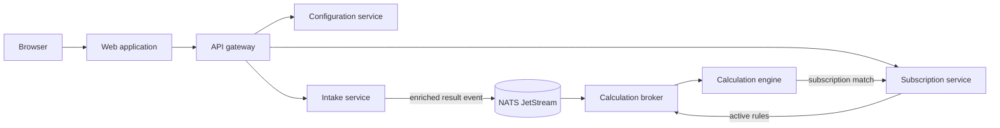

# Architecture

This document describes the system shape and how its components collaborate.
Accepted architectural decisions, including their rationale and consequences,
are recorded in [architecture decision records](../architecture/README.md).

## System shape

QMEssentials is a service-oriented, event-driven application.

NATS JetStream transports events between asynchronous stages.
PostgreSQL holds durable domain data and service-owned processing state.

## Browser boundary

The web application uses the API gateway as its browser backend.
The gateway owns the browser-facing authentication, authorization,
routing, and cross-origin boundary.
The decision and its consequences are recorded in
[ADR 0003](../architecture/0003-use-an-api-gateway-as-the-browser-backend.md).

## Service ownership

The configuration service owns products, tests, units,
and product-test configuration.
The intake service owns samples, captured test results, and result enrichment.
The subscription service owns subscription definitions, revisions, activation,
and notification coordination.
The calculation broker owns compiled subscription rules, rule matching,
and event routing.
Calculation engines own statistical processing state, anomaly detection,
processed-event identities, and match events.

Each data-owning service owns its schema and migration stream.
Services use APIs or messages rather than cross-schema access, as decided in
[ADR 0002](../architecture/0002-isolate-service-persistence.md).

## Result event flow

Intake resolves canonical test details, parses applicable sample metadata,
and publishes a versioned enriched result event.
Enrichment happens once, so downstream calculation
does not repeatedly query product configuration.

The calculation broker maintains active subscription rules,
narrows candidate subscriptions, evaluates rules,
and routes each match by subscription identity.
Calculation engines consume routed readings,
update statistical state atomically, and emit match events.
Subscription management coordinates notification delivery from those events.

Messages have stable identities,
and consumers are idempotent because JetStream delivery can be repeated.
Rebuildable processing state
can be reconstructed from retained events or authoritative result history.

## Persistence and deployment

Durable domain records use logged PostgreSQL tables.
Derived statistical state may use a different persistence policy
when it is demonstrably rebuildable,
subject to recovery and performance requirements.

Components remain independently deployable where their workloads differ:
subscription management is primarily transactional,
broker matching is CPU- and memory-oriented,
and calculation is driven by statistical complexity and state I/O.
Deployments may colocate them on one host
without erasing their ownership boundaries.
