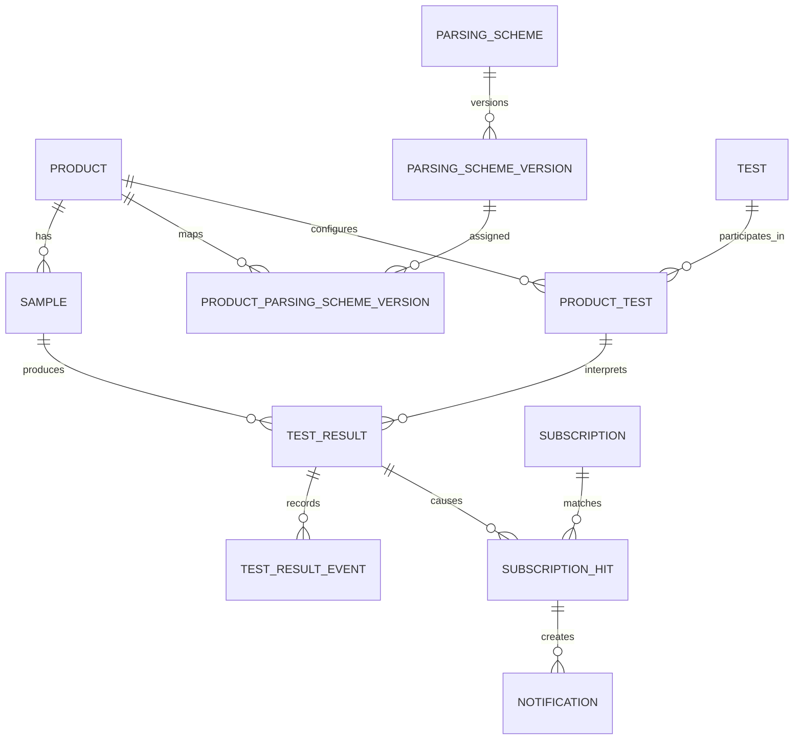

# Domain model

## Products, samples, and tests

A product is identified by part number.
A sample is identified by serial number and represents an instance of a product.
It is either available or not available for testing.
A parsing scheme extracts metadata from sample serial numbers using a regular
expression, Lua script, or webhook. Parsing schemes are separate, versioned
entities. A product maps to a parsing-scheme version for an effective time span;
an open beginning or ending date has no bound. The version applicable when a
sample is created interprets that sample's serial number.
Lua scripts execute in a QMEssentials sandbox; webhook parsers are external.
Lua parsing is a pure function: it receives a serial number and returns the
metadata data structure defined by the parsing model. It has no filesystem,
network, database, or system access.
Every parsing-scheme version defines a JSON Schema for that metadata. A parser
output that does not satisfy the schema fails parsing and triggers the
producer-notification process.

The [product requirements](product-requirements.md#sample-metadata) define
parser execution, retry, rejection, and webhook behavior.

A test has a stable canonical name distinct from its user-facing display name.
Product-test configuration determines which tests apply to a product,
their presentation order, allowed modifiers, units, precision,
specification limits, criticality, supporting documentation, and result-input
behavior. It may enable an optional free-text comment on result entry.

## Test results

A test result is identified in the domain by:

- sample serial number
- product part number
- canonical test name
- applicable modifiers

Product-test sequence controls presentation and execution order;
it is not part of result identity.

A result carries a snapshot of the fields needed to interpret it,
including its unit, decimal precision,
and effective minimum and maximum specification values.
It records the parsing-scheme version that interpreted its sample serial number.

Results are numeric measurements. A product-test configuration may allow a user
to enter an unbounded set of numeric input values. It determines whether the
system records one result derived from the average, minimum, maximum, median,
or count of those values, or records a separate result for each input value.
In separate-result mode, each recorded result retains a one-element input array;
the entry session is not retained as a separate group.
A result may retain an optional free-text comment when its product-test
configuration enables comments.

Test-result history is append-only. A void is a separate test-result event;
it does not modify the original recorded result. Current-state projections may
be derived from history for efficient queries, but history is authoritative.
The current effective-results projection is a materialized view with one row
per non-voided result.
Voiding is terminal; a replacement is a new result. There is no explicit
relationship between a replacement and a voided result.
A void emits a NATS sample-history invalidation event carrying that sample's
identity. New results use the normal incremental result-event path. Event
timestamps order history for users; calculations do not depend on input-event
order.
Each event carries a digest computed by the intake service and verified when
the event is read or replayed. The digest covers a deterministic canonical JSON
representation of the event.
When HMAC is configured, the Intake application uses one key from
environment-appropriate secret management.

A void event records the acting user, timestamp, and required reason. It may
also include an optional comment.

## Subscriptions

A subscription contains a text rule owned by a user
and has a version and activation state.
Rules select test results using product and sample metadata,
test details, result characteristics,
and—where statistical evaluation is required—a time window.

Subscription hits associate matching subscriptions with source results.
Notification enrollments describe how interested users should be notified;
notification records track delivery work arising from a hit.
