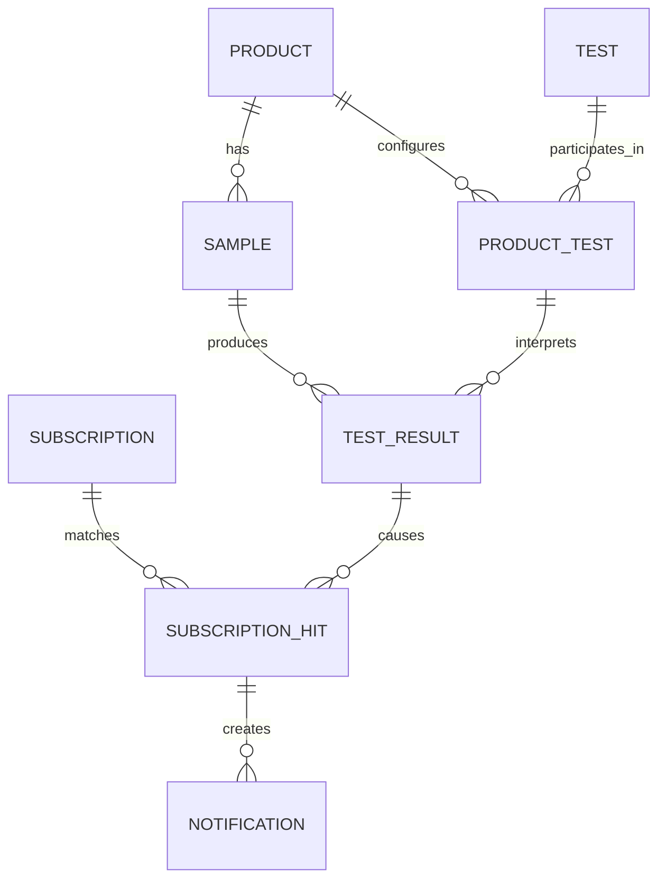

# Domain model

## Products, samples, and tests

A product is identified by part number.
A sample is identified by serial number and represents an instance of a product.

A test has a stable canonical name distinct from its user-facing display name.
Product-test configuration determines which tests apply to a product,
their presentation order, allowed modifiers, units, precision,
specification limits, criticality, and supporting documentation.

## Test results

A test result is identified in the domain by:

- sample serial number
- product part number
- canonical test name
- applicable modifiers

Product-test sequence controls presentation and execution order;
it is not part of result identity.

A result carries a snapshot of the fields needed to interpret it,
including its unit, decimal precision,
and effective minimum and maximum specification values.

## Subscriptions

A subscription contains a text rule owned by a user
and has a version and activation state.
Rules select test results using product and sample metadata,
test details, result characteristics,
and—where statistical evaluation is required—a time window.

Subscription hits associate matching subscriptions with source results.
Notification enrollments describe how interested users should be notified;
notification records track delivery work arising from a hit.
